# Mermaid Diagrams

NoteDiscovery supports **Mermaid** diagrams directly in your markdown notes! Mermaid lets you create diagrams and visualizations using text-based definitions, making it easy to version control and collaborate.

## How to Use

Simply create a code block with the language set to `mermaid`:

````markdown
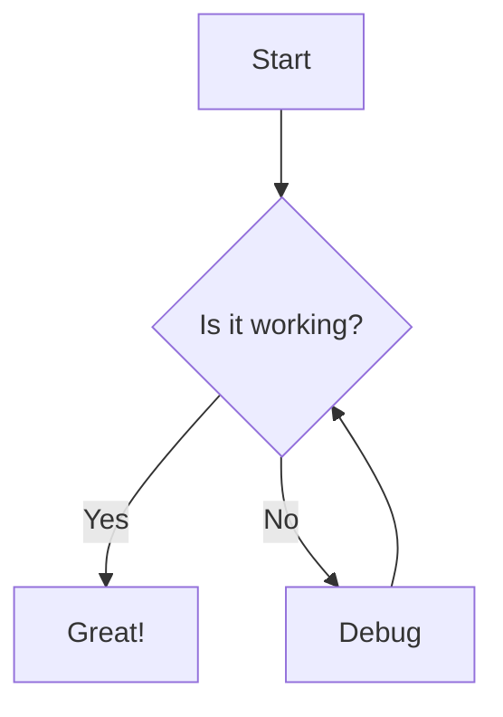
````

## Basic Examples

### Flowchart

````markdown
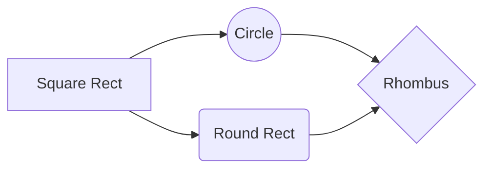
````

**Preview:**


---

### Sequence Diagram

````markdown
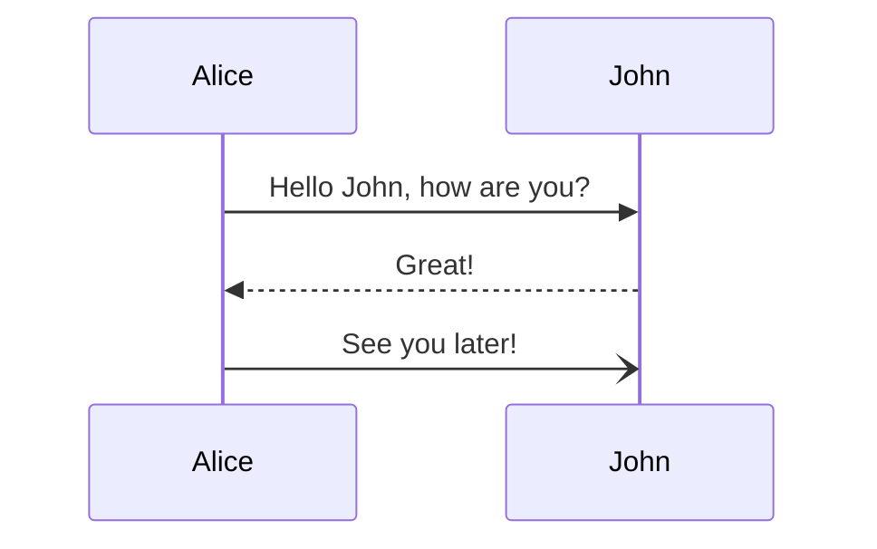
````

**Preview:**


---

### Class Diagram

````markdown
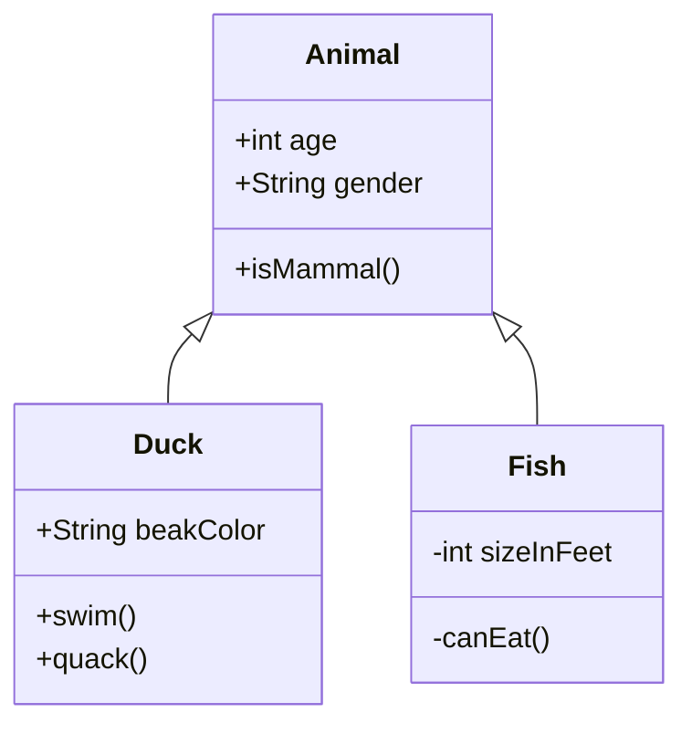
````

**Preview:**


---

### State Diagram

````markdown
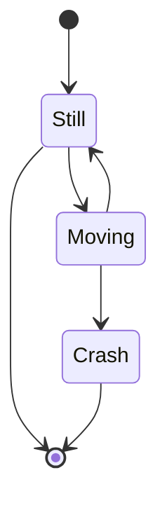
````

**Preview:**


---

### Gantt Chart

````markdown
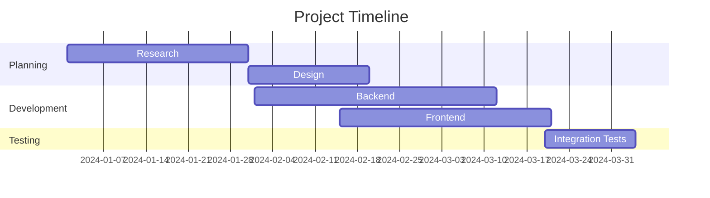
````

**Preview:**


---

### Entity Relationship Diagram

````markdown
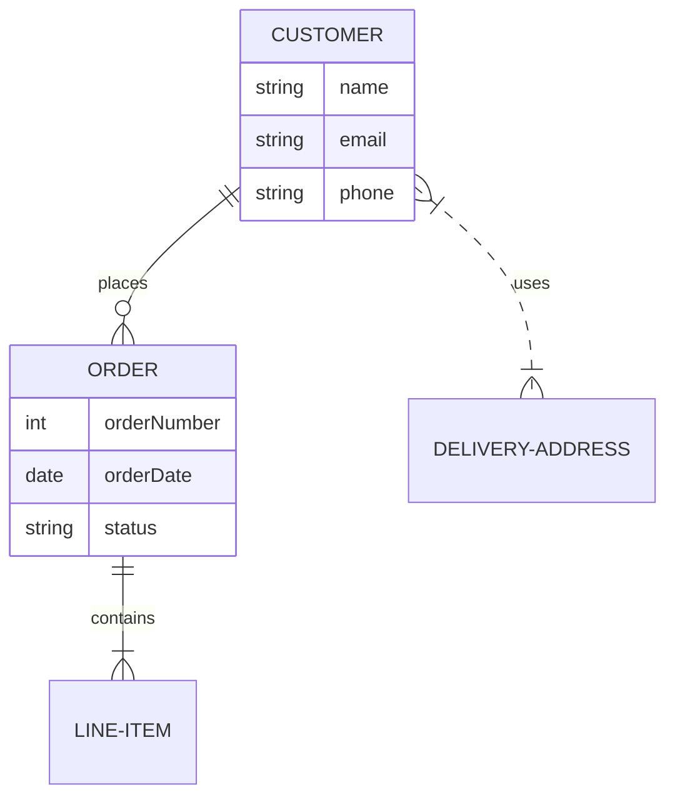
````

**Preview:**


---

### Pie Chart

````markdown
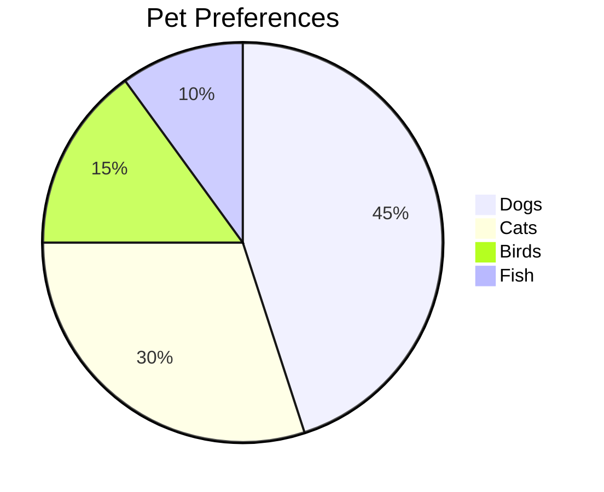
````

**Preview:**


---

### Git Graph

````markdown
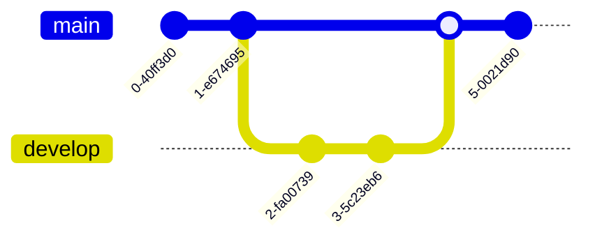
````

**Preview:**

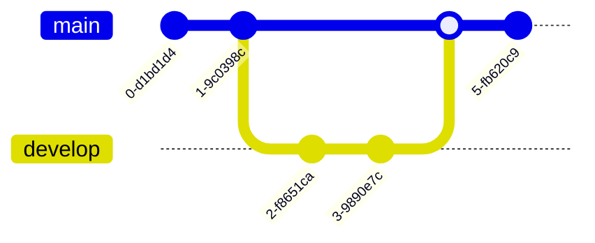

---

### User Journey

````markdown
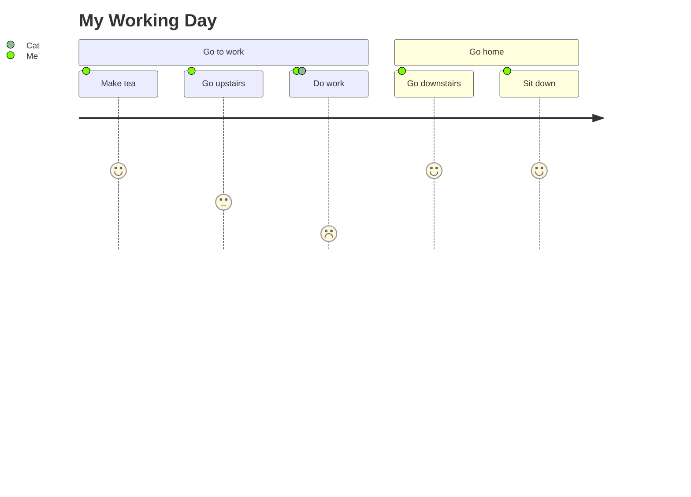
````

**Preview:**


---

### Mindmap

````markdown
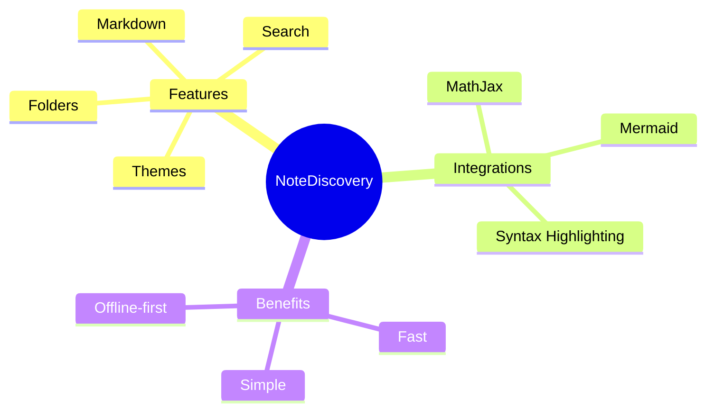
````

**Preview:**

```mermaid
mindmap
  root((NoteDiscovery))
    Features
      Markdown
      Themes
      Search
      Folders
    Integrations
      MathJax
      Mermaid
      Syntax Highlighting
    Benefits
      Fast
      Simple
      Offline-first
```

---

## Theme Support

Mermaid diagrams automatically adapt to your current NoteDiscovery theme:
- **Light themes** use the default Mermaid color scheme
- **Dark themes** use dark-optimized colors with proper contrast
- Theme changes automatically re-render all diagrams

## Tips

1. **Keep it simple**: Start with basic diagrams and add complexity as needed
2. **Use comments**: Add `%%` for comments in your Mermaid code
3. **Test syntax**: If a diagram doesn't render, check the Mermaid [documentation](https://mermaid.js.org/)
4. **Export**: Diagrams are included when you export notes to HTML

## More Information

For the complete Mermaid syntax and more diagram types, visit the official documentation:
- [Mermaid Documentation](https://mermaid.js.org/)
- [Live Editor](https://mermaid.live/) - Test your diagrams online

---

**Pro Tip**: Combine Mermaid diagrams with LaTeX math expressions and code blocks for comprehensive technical documentation! 📊

